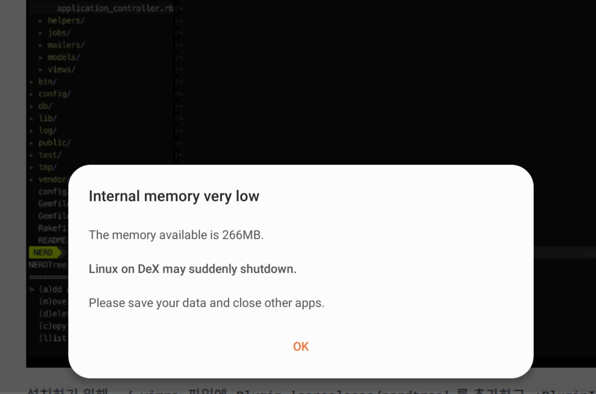

# :large_blue_circle: Open

# [URGENT] VIM to IDE


> ~~Fxxking LOD..~~

 - Linux On Dex have very tiny memory for virtualization.
 - Run VS CODE + Chrome + Terminal + etc.. then it struggle with memory shortage.
 - To solve this situation, may use Termial IDE is the answer.
 - [Vim을 IDE처럼 사용하기](https://blog.b1ue.sh/vim-ide/)

## Doky.space 개인 블로그
 - [ ] [최근 개발 흐름 따라가보기](https://fkkmemi.github.io/talk/rest-mobile/)
 - [ ] [리액트 프로젝트에 ESLint 와 Prettier 끼얹기](https://velog.io/@velopert/eslint-and-prettier-in-react)
 - [ ] [오오... 이런걸 만드셨다니..(존경)](https://velog.io)
 - [ ] [Algolia 적용](https://imreplay.com/blogging/%EA%B2%80%EC%83%89-%EB%8F%84%EA%B5%AC%EC%9D%B8-Algolia%EB%A5%BC-%EC%A0%81%EC%9A%A9%ED%95%B4%EB%B3%B4%EC%9E%90/)

### 마크다운 랜더러
 - [ ] [marked.js example for Vue.js](https://vuejs.org/v2/examples/)
 - [ ] [마크다운 랜더러](https://derveljunit.tistory.com/287)
 - [ ] [package.json에서 ~(틸트)와 ^(캐럿)의 차이점](https://blog.outsider.ne.kr/1041)

### Nuxt.js
 - 19.10.08
 - [ ] [NUXT로 혼자 웹사이트 만들기 1 소개](https://fkkmemi.github.io/nuxt/nuxt-001-intro/)
 - [ ] [nuxt/nuxt.js](https://github.com/nuxt/nuxt.js)
 - [ ] [GitHub Pages에 배포하기](https://ko.nuxtjs.org/faq/github-pages/)
 - [x] ~~[Nuxt.js 개념부터 설치까지 빠르게 배우기](https://kdydesign.github.io/2019/04/10/nuxtjs-tutorial/)~~
 - 블로그 제작 시, 백엔드+프론트엔드 작업 용이할 듯!
 - SSR이 백엔드 api 코드를 빌드할 수 있게 도와주는 건지..? 기존의 백엔드 코드를 빌드된 형태로 사용할 수 있게 하는게 SSR인지 알아보기!

<br>

## Electron JS
 - 19.09.15
 - [x] [Electron JS](https://electronjs.org/#apps)
 - [x] [일렉트론 1.0 가볍게 시작하기 - 01 일렉트론 소개 (Introduce Electron) YT](https://www.youtube.com/watch?v=69D1PIZqUQk)
 - [x] [Electron 개념정리](https://cyberx.tistory.com/206)
 - [ ] [웹으로 PC프로그램 만들 수 있다!!? (Electron + Vuejs)](https://jinblog.kr/189)  
 - [ ] [일렉트론 개발환경 구축하기](https://cyberx.tistory.com/209)
 - [ ] [Electron 0 일렉트론뷰로 우아한 데스크탑 앱 만들기 기초](https://fkkmemi.github.io/electron/electron-00-intro/) 
 - [ ] [Electron 문서](https://electronjs.org/docs)

## Markdown MemoPad App
 - chrome app & electron app

### Google Chrome 알림 (+FCM)
 - [ ] [크롬 확장 프로그램 만들기, GCM 알림 받기](https://falsy.me/%ED%81%AC%EB%A1%AC-%ED%99%95%EC%9E%A5-%ED%94%84%EB%A1%9C%EA%B7%B8%EB%9E%A8-%EB%A7%8C%EB%93%A4%EA%B8%B0-gcm-%EC%95%8C%EB%A6%BC-%EB%B0%9B%EA%B8%B0/)
 - [ ] [웹 앱에 푸시 알림 추가](https://developers.google.com/web/fundamentals/codelabs/push-notifications/?hl=ko)

### nw.js
 - 19.9.24
 - [ ] [nwjs를 통한 하이브리드 데스크탑 어플리케이션 만들기](https://tyle.io/blog/67)

### NeDB
 - 19.9.24
 - [ ] [[javascript] 자바스크립트 기반의 NeDB 사용하기](https://sub0709.tistory.com/51)
 - [ ] [NeDB - JSON 데이터 저장 데이터베이스 추천 및 예제 설명](https://niceman.tistory.com/100)

<br>

## Python
 - 19.10.15

## TypeScript
 - 19.10.01
 - [ ] [**TypeScript-Handbook 한글 문서**](https://typescript-kr.github.io/)
 - [ ] [TypeScript의 소개와 개발 환경 구축](https://poiemaweb.com/typescript-introduction)
 - [ ] [TypeScript를 무서워하지 않아도 되는 이유](https://han41858.tistory.com/14)
 - [ ] [TypeScript 현업 적용 후기](https://medium.com/tapjoykorea/typescript-%ED%98%84%EC%97%85-%EC%A0%81%EC%9A%A9-%ED%9B%84%EA%B8%B0-caad266c8142)

## PWA
 - 19.10.08
 - [ ] [[PWA] 프로그레시브 웹 앱 시작하기 (1) - PWA란?](https://codevkr.tistory.com/85)

## Shell Script
 - 19.9.22
 - 자료 수집 중...

<br>

# :red_circle: Pending

## Vue.js
 - 19.06.24
 - [ ] [실무에서 사용하는 Vue.js 프로젝트 구조
](https://joshua1988.github.io/web-development/vuejs/vue-structure/)
 - [ ] [웹팩의 file-loader와 url-loader](http://jeonghwan-kim.github.io/js/2017/05/22/webpack-file-loader.html)
 - [ ] [Vue-Cli](http://vuejs.kr/vue/vue-cli/2018/01/27/vue-cli-3/)
 
## Continuous Integration (Travis-CI)
 - 19.08.19
 - [ ] 대표적인 CI툴: Jenkins, TeamCity, AppVeyor, etc..
 - [ ] [Getting Start 1](https://gompangs.tistory.com/entry/GIT-CIcontinuous-Integration%EB%9E%80-travis-%EC%82%AC%EC%9A%A9%EB%B2%95)
 - [ ] [Getting Start 2](http://guswnsxodlf.github.io/how-to-use-travis-ci)
 - [ ] [Getting Start 3](https://nesoy.github.io/articles/2017-01/travis-ci)
 - [ ] [Travis-CI Official Tutorial](https://docs.travis-ci.com/user/tutorial/) <br><br>
 - [ ] [Gradle + SpringBoot + Travis CI + Coveralls + 텔레그램 연동하기](https://jojoldu.tistory.com/275)
 - [ ] [웹 퍼블리싱(스프링부트) 실습 (10강 중 1강)](https://jojoldu.tistory.com/250?category=635883) <br><br>
 - [ ] [안드로이드+트래비스CI](https://androidhuman.tistory.com/540)
 - [ ] [Node.js+트래비스CI](https://blog.outsider.ne.kr/781)
 - [ ] [Node.js+트래비스CI+코드커버리지](https://sanghaklee.tistory.com/53)
 - [ ] [Setup Continuous Integration with Travis CI in Your Nodejs App](https://dev.to/lauragift21/setup-continuous-integration-with-travis-ci-in-your-nodejs-app-26i2)

## Continuous Integration (Jenkins)
 - 19.08.20
 - [ ] https://kingbbode.tistory.com/35
 - [ ] http://www.itworld.co.kr/news/107527
 
## Github
 - 19.08.20
 - [ ] [reference](https://www.lesstif.com/pages/viewpage.action?pageId=54952153)
 - [x] [shields.io](https://shields.io/)
 - [ ] [Github of shields.io](https://github.com/badges/shields)
 - [ ] [How to write **readme.md** better](https://newhiwoong.github.io/%EA%B8%B0%ED%83%80%20%EC%A0%95%EB%B3%B4%20%EA%B3%B5%EC%9C%A0/%EC%88%98%EC%A4%80%EA%B8%89%EC%9D%98-Github-README.md-%EC%9E%91%EC%84%B1%ED%95%98%EA%B8%B0)
 - [ ] [resume](https://sujinlee.me/professional-github/)
 - [ ] [awesome readme](https://github.com/matiassingers/awesome-readme)
 - [ ] [example](https://github.com/sujinleeme/readme-template/tree/master/korean)
 - [ ] [markdown](https://how-to-use.tistory.com/2)
 - [x] [**readme-md-generator**](https://github.com/kefranabg/readme-md-generator)
 - [ ] [simpleicons](https://simpleicons.org/)
 - [x] [[Git] git add 취소하기, git commit 취소하기, git push 취소하기](https://gmlwjd9405.github.io/2018/05/25/git-add-cancle.html) `reset HEAD@` `reset HEAD^` `reset --hard`
 - [x] [Git. Tag 추가, 변경, 삭제](https://devmjun.github.io/archive/GitTag)

## Opensource License
 - 19.08.20
 - [ ] http://www.bloter.net/archives/209318
 - [ ] http://jinyongjeong.github.io/2016/06/01/software_license/
 - [ ] https://zinee-world.tistory.com/308

## Heroku
 - 19.09.03
 - [ ] [[Node.js] Heroku로 배포( deploy )하기](https://victorydntmd.tistory.com/112)
 - [ ] [Heroku(헤로쿠) 가입, Heroku CLI 다운로드, 간단 사용법](https://www.a-mean-blog.com/ko/blog/%EB%8B%A8%ED%8E%B8%EA%B0%95%EC%A2%8C/_/Heroku-%ED%97%A4%EB%A1%9C%EC%BF%A0-%EA%B0%80%EC%9E%85-Heroku-CLI-%EB%8B%A4%EC%9A%B4%EB%A1%9C%EB%93%9C-%EA%B0%84%EB%8B%A8-%EC%82%AC%EC%9A%A9%EB%B2%95)

## Typora Diagram
 - [ ] [실시간 미리보기와 코드 펜스 기능을 갖춘 다기능 마크다운 에디터 'Typora'](https://macnews.tistory.com/4799)

## Swift
 - 19.01.19

## Docker
 - 19.05.12
 - [ ] https://www.44bits.io/ko/post/why-should-i-use-docker-container
 - [ ] https://www.slideshare.net/pyrasis/docker-fordummies-44424016
 - [ ] http://www.itworld.co.kr/news/110748
 - [ ] http://devstory.ibksplatform.com/2018/06/docker.html

## iOS
 - 19.06.?

## Plan
 - Python Study
 - Kotlin Study

<br>

# :black_circle: Closed

## :heavy_check_mark: Git-Flow 및 버전관리
 - https://github.com/DokySp-study/git-flow-test
 - [x] [[Git]Tag 추가, 변경 및 삭제하기](http://minsone.github.io/git/git-addtion-and-modified-delete-tag)
 - [x] [Git Flow Integration으로 Git Flow 심플하게 운영하기](https://jojoldu.tistory.com/268)
 - [x] [Git의 개념과 Git Flow](https://cupjoo.tistory.com/6)
 - [x] [Git flow 사용해보기](https://boxfoxs.tistory.com/347)
 - [x] [GIT을 기반으로 한 프로젝트 개발프로세스](https://gist.github.com/ihoneymon/a28138ee5309c73e94f9)
 - [x] [git-flow cheatsheet.io](https://danielkummer.github.io/git-flow-cheatsheet/index.ko_KR.html)
 - [x] [github 프로젝트 릴리즈 하는 법](https://www.lesstif.com/pages/viewpage.action?pageId=20774996)
 - [x] 
 - `~/.profile` 에 아래 코드를 추가
   ```bash
   alias gitlog='git log --all --decorate --oneline --graph'
   ```
 - [x] ~~뭔가.. 잘 안된다.. 좀 더 연습해봐야 할듯 ㅠㅜ~~ 맨 위 링크 보면서 복습!

## :heavy_check_mark: zsh 설치 및 플러그인
 - `$ sudo apt-get install zsh`
 - `$ curl -L https://raw.github.com/robbyrussell/oh-my-zsh/master/tools/install.sh | sh`
 - [zsh-autosuggestions](https://github.com/zsh-users/zsh-autosuggestions)
 - [zsh-syntax-highlighting](https://github.com/zsh-users/zsh-syntax-highlighting)
 - [Zsh community projects](https://github.com/zsh-users/)
 - npm global 설치 항목이 실행되지 않을 경우, `.zshrc` 마지막에 `source ~/.profile` 적어주기 
 
## :heavy_check_mark: Wordpress 설치법
 - 19.02.08
 - https://github.com/DokySp/how-to-install-wordpress-kr

